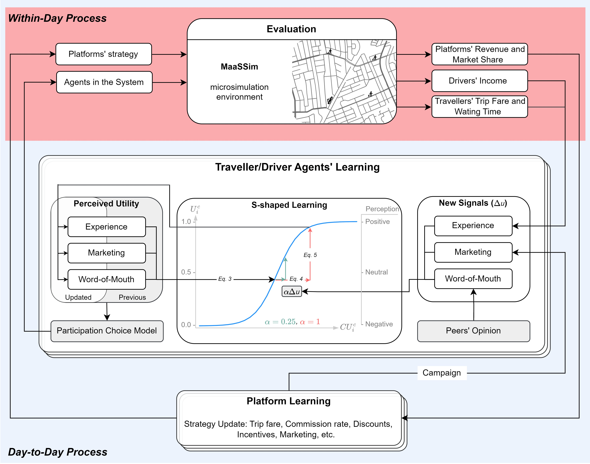

### MoMaS: two-sided Mobility Market Simulation farmework 

You can access the full paper on MoMaS and its applications [here](https://www.sciencedirect.com/science/article/pii/S0968090X24005114?ref=pdf_download&fr=RR-2&rr=91e147d6fdfdb8f6).

 MoMaS is an agent-based simulation framework built on [MaaSSim](https://github.com/RafalKucharskiPK/MaaSSim), reproducing the evolution in two-sided mobility markets. It features a novel day-to-day learning model specific to platform’s growth mechanism. In MoMaS, each traveler/driver agent gradually learns the actual platform utility based on multiple endogenous and exogenous factors. While agent's perceived utility of platform mainly relies on the collected experiences (fare and waiting time for traveler and income for driver), other significant components, namely: platform’s marketing and peer’s word-of-mouth are included in the decision making process. While these three components are sufficient to encapsulate the essence of participation decision of the agents in two-sided mobility market, further extensions and refinements are possible for a more nuanced understanding. Each utility component is updated separately upon receiving a new utility signal from the respective source, such as agent's own experience, marketing campaign of platform, and peers' opinion.

The time-dependent adjustment process for each utility component is handled with the proposed S-shaped learning model in three steps: first, the cumulative utility, i,e,. the historical experiences/exposures, for respective component is retrieved from last perception. Second, it is updated with the signal which outputs the new cumulative utility. Third, a new perception is calculated based on the updated cumulative utility. Finally, adjusted components are summed with respective weights and used to evaluate the participation probability of each agent, and a new within-day simulation is run with the pool of agents who opt to participate. To model participation decision, we implement the binary logit choice model where each traveler/driver make daily choices between platform and alternative options, undergoing an unique evolutionary path.

In such a way, MoMaS reproduces the detailed behavior and interaction of the agents in two-sided mobility market based on their history updated through multiple channels. Like in the reality, while with consecutive positive/negative signals agents can reinforce their opinion about the platform reaching loyalty/reluctancy, new signals which do not match the previously learnt expectations can shift any attitude to reverse. Such modeling features are necessary to explicitly reproduce the both positive and negative cross-sided network effects in the market. Our framework enables the platforms to control these effects via strategic levers to grow and reach sustainability in terms of market share and profitability. Hence, we advocate MoMaS for providing a complete picture of dynamics in the two-sided mobility market both at the individual and the aggregated level giving rise to realistic evolution trajectories.

  

Fig. 1 *Methodology at glance. In the within-day process (top), the MaaSSim agent-based simulator is served by participating agents and platform strategy, which outputs the relative experiences for the parties: waiting time and trip fare for travelers, income for drivers, and market share and revenue for the platform. In the day-to-day process (bottom), traveler and drivers agents learn the platform utility through three channels, namely: their own experience, peers' word-of-mouth, and platform's marketing. These utility components determine the agents' perceived utility, and, subsequently, their choice for the next day. Each component is updated with the S-shaped learning models relying on the signal strength and learning degree. The higher learning degree (red) results in a greater adjustment (faster learning) in comparison to the low learning degree. Notably, the learning sensitivity depends on the position on the S-shaped curve, the updates are minor for both highly negative and positive utilities and high when the opinion is neutral. Platform strategy is implemented through various strategic levers and can be adjusted day-to-day based on the with-in day evaluations.*

-----
### MaaSSim: agent-based two-sided mobility platform simulator

&nbsp;&nbsp;&nbsp;&nbsp;&nbsp;&nbsp;&nbsp;&nbsp;&nbsp;&nbsp;&nbsp;&nbsp;&nbsp;&nbsp;&nbsp;&nbsp;&nbsp;&nbsp;&nbsp;&nbsp;&nbsp;&nbsp;&nbsp;&nbsp;

MaaSSim is an agent-based simulator, reproducing the dynamics of two-sided mobility platforms (like Uber and Lyft) in the context of urban transport networks. It models the behaviour and interactions of two kind of agents: (i) travellers, requesting to travel from their origin to destination at a given time, and (ii) drivers supplying their travel needs by offering them rides. The interactions between the two agent types are mediated by the platform, matching demand and supply. Both supply and demand are microscopic. For supply this pertains to the explicit representation of single vehicles and their movements in time and space (using a detailed road network graph), while for demand this pertains to exact trip request time and destinations defined at the graph node level. Agents are decision makers, specifically, travellers may reject the incoming offer or decide to use another mode than those offered by the mobility platform altogether. Similarly, driver may opt-out of the system (stop providing service) or reject/accept incoming requests. Moreover, they may strategically re-position while being idle. 

All of above behaviours are modelled through user-defined **decision modules**, by default deterministic, optionally probabilistic, representing agents' taste variations (heterogeneity), their previous experiences (learning) and available information (system control). 
Each simulation run results in two sets of outputs, one being the sequence of recorded space-time locations and statuses for simulated vehicles and the other for travellers. Further synthesised into agent-level and system-wide KPIs for in-depth analyses.

## Documentation

1. [MoMaS Tutorials](https://github.com/RafalKucharskiPK/MaaSSim/tree/master/docs/tutorials)
2. [MaaSSim Tutorials](https://github.com/RafalKucharskiPK/MaaSSim/tree/master/docs/tutorials)

    
----
Farnoud, Ghasemi 2025
